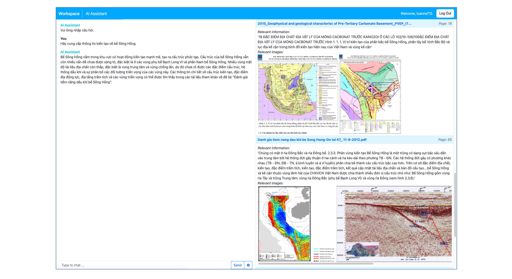

## Knowledge Sharing Platform

### Key Results
- Unstructured data processing (PDF, DOC, TXT, images, etc.) to generate a unified database.
- RAG chatbot system to interact with domain knowledge.
- Web-app interface for chatbot and references.
- Web-app interface for document preview and sharing.

### Platforms/Frameworks
- Data storage: MS SharePoint
- SQL database: MySQL
- Vector database: Weaviate
- Web front-end: HTML, CSS, JS
- Web back-end: Django
- Chatbot: OpenAI, Semantic Kernel